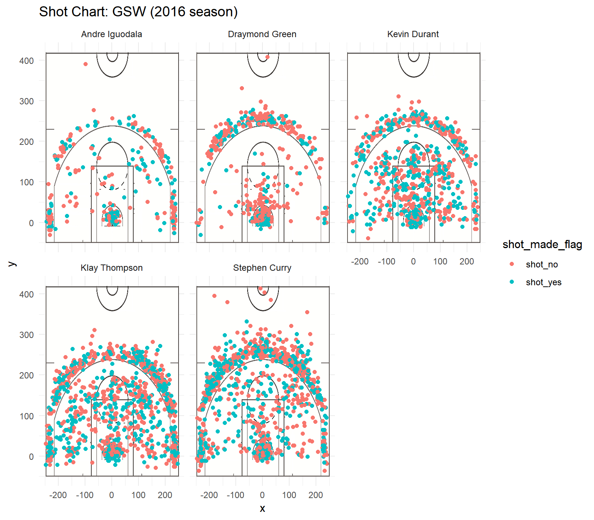

```{r echo = FALSE, result = 'hide', message = FALSE}
# import packages
library(dplyr)
library(knitr)
# import shots-data.csv
coltypes <- c("character", "character", "integer", "integer", "integer", "integer", "factor", "character", "factor", "integer", "character", "integer", "integer", "factor", "integer")
shots_data <- read.csv("../data/shots-data.csv", stringsAsFactors = FALSE, colClasses = coltypes)
```

# **Background and Introduction**

The Golden State Warriors won their NBA Championship in 2015-2016 season for the first time in 40 years. Since then, the Warriors has been considered one of the NBA・s best teams. Obviously, the Warriors・ success was not due to luck. Instead, the key factor is their players.  

This report summarizes NBA 2016-2017 season・s shooting data of the Golden State Warriors' five players, Andre Iguodala, Draymond Green, Kevin Durant, Klay Thompson and Stephen Curry. From the analysis, we can get a glimpse of how the Golden State Warriors・ players and their high shooting accuracy bring them to where they are today.  

# **Objective**

From this report, you will get the first glimpse of the strengths of the five well-known players of the Warriors, Andre Iguodala, Draymond Green, Kevin Durant, Klay Thompson and Stephen Curry, individually and determine who is the most accurate shooter by analyzing the shooting data.

# **Data Analysis**

The data we will be analyzing is NBA 2016-2017 season・s shooting data, provided by Professor Gaston Sanchez. See more details of the data set from *data-dictionary* under *data* folder.  

The variables we will be using to calculate the **2PT Effective Shooting %**, the **3PT Effective Shooting %**, and the overall **Effective Shooting %** are *shot_made_flag*, which indicates whether a shot was made(shot_yes) or missed (shot_no) and *shot_type*, which indicates whether a shot is a 2-point field goal or a 3-point field goal of each player.  

Here are brief explanations of the columns you will see below:  
**total**: The total shots one player had attempted during the season.  
**made**: The total shots one player had made during the season.  
**perc_made**: $ \cfrac{made}{total}*100 $%, the effective shooting percentage.  

### **2PT Effective Shooting %**  
```{r}
effective_shooting_2pt <- shots_data %>%
  group_by(name) %>%
  summarise(total = sum(shot_type == "2PT Field Goal"), 
            made = sum(shot_made_flag == "shot_yes" & shot_type == "2PT Field Goal"), 
            perc_made = made/total*100) %>%
  arrange(desc(perc_made))
kable(effective_shooting_2pt)
```

This table displays the 2-point field goal effective shooting percentage of each player. Andre Iguodala has the highest 2-point field goal effective shooting percentage, followed by Kevin Durant and Stephen Curry. One thing worth mentioning is that though Andre Iguodala has the highest 3PT effective shooting percentage, the number of his total attempted shots is low. However, Kevin Durant, Stephen Curry, and Klay Thompson attempted at least 1.5 times more than Andre Iguodala did. Judge by the score-earned perspective, Kevin Durant, Stephen Curry, and Klay Thompson performed better than Andre Iguodala did.  

### **3PT Effective Shooting %**  
```{r}
effective_shooting_3pt <- shots_data %>%
  group_by(name) %>%
  summarise(total = sum(shot_type == "3PT Field Goal"), 
            made = sum(shot_made_flag == "shot_yes" & shot_type == "3PT Field Goal"), 
            perc_made = made/total*100) %>%
  arrange(desc(perc_made))
kable(effective_shooting_3pt)
```

This table displays the 3-point field goal effective shooting percentage of each player. Klay Tompson has the highest 3-point field goal effective shooting percentage, followed by Stephen Curry and Kevin Durant. Notice that the average accuracy from 3-point range in the NBA is 36% in 2013-2014 season (see reference), four of the five players of the Warriors have 3PT effective shooting percentage higher than 36%! No wonder the Warriors always scored high during games.  

### **Effective Shooting %**  
```{r}
effective_shooting_total <- shots_data %>%
  group_by(name) %>%
  summarise(total = sum(shot_made_flag == "shot_yes") + sum(shot_made_flag == "shot_no"), 
            made = sum(shot_made_flag == "shot_yes"), 
            perc_made = made/total*100) %>%
  arrange(desc(perc_made))
kable(effective_shooting_total)
```

This table displays the effective shooting percentage of each player. Kevin Durant has the highest effective shooting percentage, followed by Andre Iguodala, Klay Tompson and Stephen Curry. Once again here, the number that Andre Iguodala had attempted is much less than his teammates.  

### **Shot Chart**
```{r}

```

We can have a clearer view of the shooting accuracy of each player from the Shot Charts above. Obviously, Andre Iguodala and Draymond Green are not the main scorers, they made fewer attempts during games. Also, the pink dots on Draymond Green・s shot chart is relatively more than the pink dots on his teammates・ shot charts, which means that Draymond Green has a relatively low effective shooting percentage. By observing the location and the density of the dots, we can also conclude that Klay Thompson and Stephen Curry are better 3-point scorers and Kevin Durant is a better 2-point scorer.    

# Conclusion

From the analysis above, we can conclude that Kevin Durant is the best 2-point scorer and Klay Thompson and Stephen Curry are better 3-point scorers among the five players. Also, all of the three players・ performances on 3PT effective shooting percentages are higher than the NBA・s average 3PT effective shooting percentage, 36%, of 2013-2014 season. Overall, Kevin Durant has the best performance. Andre Iguodala and Draymond Green are not the best scorers on the team. However, they might have their own outstanding advantages. For example, though Andre Iguodala made fewer attempts during the games, we can not ignore that he actually has the highest 2-point field goal effective shooting percentage; though Draymond Green has the lowest 2PT, 3PT, and total effective shooting percentages among the five players, he is still a valuable player that is well-known for passing ball.  

# Discussion

This data analysis is not comprehensive due to the limited data. Many improvements can be made to make the report more complete, thorough, and persuasive. For example, by including more years of data, we can analyze the transformation of performances of each player, or with a bigger database, we can get more accurate statistics of their performances; by including more data of other teams・ players, we can compare the players・ performances and get a better sense of how the Warriors perform compare to others. 

# Reference

[In a shooter's league, 38.0 percent from three is the ultimate team goal](https://www.cbssports.com/nba/news/in-a-shooters-league-380-percent-from-three-is-the-ultimate-team-goal/) by Zach Harper